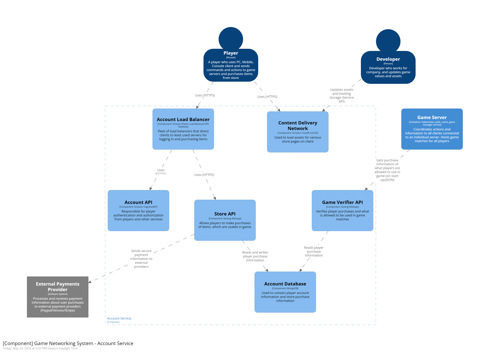

# System Context Overview

The project is the networking architecture for a game client to connect to dedicated game servers in our environment and communicate with other players and also allow players to make in-app purchases, which they may use in their multiplayer games.  We have identified 2 users of the system, the internal developer and a player who has downloaded our game client on a device of their choosing.  

Below is our system context view, showing a general top view of system (users interact with system, which talks to external system) (See [legend](#legend) at bottom of document for reference)

Below we will describe the general flow of a player user logging in, buying an item and then playing a match.  As well as technological decisions with each component!

# Project Container Overview

### Decisions and Flow

The design to note here is that there are 2 main connection types a user may use, for many options such as logging in, using the store and matchmaking they use HTTP calls and pass JSON, but when talking to game server instances themselves, they use socket connections and are always connected to the servers themselves and pass a lightweight, custom message format to the server to keep network traffic fast.  The servers themselves are interconnected to a degree, but for many of them if one system goes down, it does not bring down game sessions for the most part as that networking is separate.

## Account Component

### Decisions and Flow
At the beginning of a player starting up the game, that user first logs in to our authentication service, which will be behind a load balancer/api gateway.  They will take that token with them to all services that will then use that token to authenticate the user.  We imagine using amazon cognito to keep complexity down and load balancer to alleviate traffic on a server, which should scale to our needs automatically.  

Next the user, may want to go purchase a skin or item from our in-game store.  They will contact our api, which will return a list of products, they will choose one and communicate their payment information with our store api, which will verify with the external payment provider (think Paypal/Venmo/Stripe/etc).  Once we get confirmation of purchase, we write that information to the store/account database, which uses MongoDB, which we chose for its speed and ability to scale.  We don't imagine this database being hit too much and can go down as its not critical for a player to use their skins to play a game (although is a customer issue), but being able to scale these should make it highly available for the game verifier to check for game servers.

## Matchmaking Component

### Decisions and Flow
If the player would like to play a match with other players, in the client they may hit "play match" which will send a request to our matchmaking service api, which will put that player in a "queue", this uses Amazon Gamelift service and their matchmaking logic, which puts a "ticket" into a DynamoDB table, while another service, which we will call the "ranker" service will sort through various metrics (like match history, rank, connection, etc) and match players together, with players not being matched the longest being prioritized higher.  After finding a match for a group of players, it updates the ticket which when the client requests an update on status, will get a notification and accept the match.  

We put a Amazon load balancer in front to distribute load to our matchmaking servers as requests can come quickly and overload the system, this will then use Amazons built in game systems as building our own matchmaking has a high development cost (and products exist) and cost is relatively cheap (using auto scaling groups to handle load will be necessary). Amazon even offers the application in the cloud or standalone for us to run.  DynamoDb is the best supported with this. After the ranker finds a match it updates the ticket in the database with relevant server and match info and that is sent back to the client when they ask for an update on their queue position.

## Game Service Component

### Decisions and Flow
Once a match is configured from matchmaking, it sends a notification to our game manager, which will spin up a game instance and report those connections details back to the matchmaking service.  Once players receive that info, they connect the particular instance.  As players load in, the service requests general game information about the players and current patch, which it retrieves from the data service api, as players configure their character, the game server will also get purchase information from account services and allow a player to use skins if available.  After the game is completed, the game manager updates the data api service with match information and stats and cleans up the game session.

Some decisions here is the game manager, which is a normal web application that will keep track of matches and speaks to the data service on match status periodically.  The game pods/instances are run using a container/image (on top of kubernetes) is similar  to our client code (built from same engine).  On startup it verifies player connection, what skins characters may use from our store (if connection is down, skin is unusable in game or can check data service if possible from previous matches), next  and also because characters may only play a subset of characters we do not load all information into the game, we only load relevant player info and character info from the data api service, which keeps image size small and data requests brief to the api layer.  Next while the game is updating each player, on each update tick for the server it will push the game state and actions to a Redis caches, which will find its way eventually to the data service api after going through an ingest script that checks.  We do this two-fold, if the game server a player is going on down, we may be able to roll back to a previous state in game if possible instead of cancelling game and for metrics/monitoring of game.  Also the ability of using containers and an orchestration layer (like Kubernetes) allows this to be possible as moving pods is easy and spinning up a game is quick and adding more nodes is simple using something like EKS. 

## Data Services Component

### Decisions and Flow

As players play and start up game servers, the data service layer is used to communicate player information back to the game servers, while also getting updates from the game manager and redis caches.  We use a scalable database like mongo as the type of data we want to manage may change frequently, so the data structure of Mongo is wanted, while its scalability and availability functions are also great.  Being able to spin up more servers to handle an increase in games should be simple.  Also this is a critical component to game servers if database/api is down, then game servers may not be able to start up, but after initial startup, game servers should be able to continue until finished.  The API should be accessed frequently, but a simple fleet of web apps with a REST API should be able to handle its load.

# Developers User and Role

The developers role in the system is to either update the store (S3 backend/Store API/promotions) and also the data service (for instance, edit a characters damage or health or a weapons stats, which would reflect in future games for players).  The technical constraints are not notable as access and editing should be infrequent, but does show how they are updated

# Legend

Legend for Containers and Components

Legend for System Context

